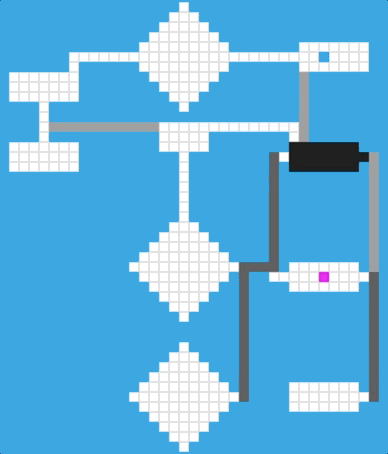

# A* search

This application implements the A* search algorithm. The SDL library is used to show the expansion as well as the final path found by the algorithm.



## Usage

### Dependencies

* cmake >= 3.7
  * All OSes: [click here for installation instructions](https://cmake.org/install/)
* make >= 4.1 (Linux, Mac), 3.81 (Windows)
  * Linux: make is installed by default on most Linux distros
  * Mac: [install Xcode command line tools to get make](https://developer.apple.com/xcode/features/)
  * Windows: [Click here for installation instructions](http://gnuwin32.sourceforge.net/packages/make.htm)
* SDL2 >= 2.0
  * All installation instructions can be found [here](https://wiki.libsdl.org/Installation)
  * Note that for Linux, an `apt` or `apt-get` installation is preferred to building from source.
* gcc/g++ >= 5.4
  * Linux: gcc / g++ is installed by default on most Linux distros
  * Mac: same deal as make - [install Xcode command line tools](https://developer.apple.com/xcode/features/)
  * Windows: recommend using [MinGW](http://www.mingw.org/)

### Build Instructions

```
$ cmake -S . -B build
$ cmake --build build
$ cd build
$ ctest # pass tests
$ ./AstarSearch <task number> # to execute the program
```

### Starting the search

Run `./AstarSearch` followed by the number of the task (map) to see the search iteration process plus the final solution found.

For instance, to run task 1, run `./AstarSearch 1`.

The available tasks are `0`, `1`, `2`, `3`, `4`.

## Project Structure

This project is organized into four main classes:
* **Map**: Represents the grid of the game and is therefore a container of all the cells. In this class the SDL window and render are created. It also contains very important methods like: `createMap()`, which creates the initial matrix of cells; `print()`, which rerenders every cell.
* **Cell**: Represents a cell, which is the most basic unit. A cell is defined by a `SDL_Rect` (which contains the underlying rectangle that this cell has), its corresponding `x, y` coordinates locating the cell in the map, `value` (representing the cost of the cell) plus some booleans indicating the status of the cell: `isStart`, `isGoal`, `isSolution` and `isReached`.
* **Node**: This class serves as a wrapper to keep track of the `state` (its corresponding cell), `parent` (best parent so far), `g` (cost), `h` (heuristic) and `f` (g+f).
* **Astarsearch**: The astar search class is the class that puts all of this together. Given a problem definied by a map, a start, a goal and a set of possible actions, which are passed in its constructor method, it uses the `BestFirstSearch()` method to find the shortest path between two points.

## Credits

### Used resources

* Russell, Stuart J.; Norvig, Peter 2021, *Artificial Intelligence: A Modern Approach* (4th Edition, Global Edition) Pearson Education.
* [SDL Wiki](https://wiki.libsdl.org/APIByCategory)

### Contributors

* [Sara Garci](s@saragarci.com)

## License

© Copyright 2021 by Sara Garci. All rights reserved.
